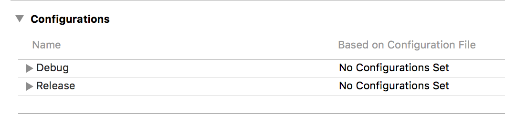
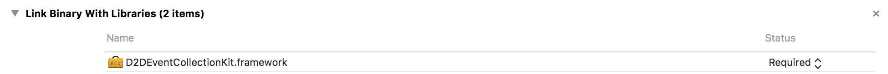
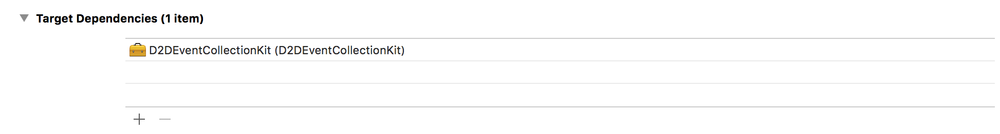
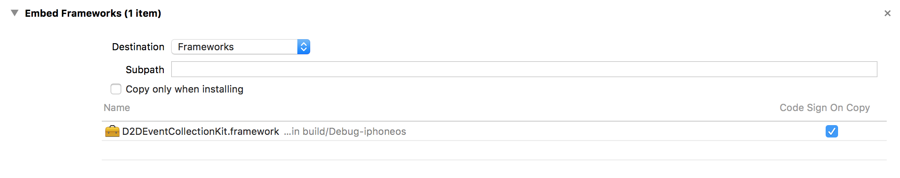
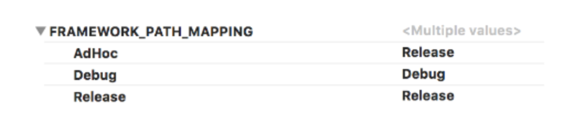

# D2DEventCollectionKit
A **dependency-free** iOS SDK for using the Door2Door mobility analytics.
	
##Table of contents

1. [Technical requirements] (#1-technical-requirements)
2. [Setup] (#2-setup)
3. [Guide] (#3-guide)
4. [Reference] (#4-reference)
5. [License] (#5-license)

## 1. Technical Requirements

The event collection API wrapper can be used with ``Swift 3.x`` and higher as well as with ``Objective-C``. It has also been made compatible with certain dependency managers. The SDK can be used with the following:

 * ``Swift 3.x``
 * ``Objective-C``
 * ``Cocoapods``
 * Use the ``Xcode project`` directly in the project

**Demo projects:** Please check the demo projects to see how to implement the SDK, set it up, create an event and send it to the backend. There is one demo project for ``Objective-C`` and another for ``Swift`` based implementations. 

To embed the ``D2DEventCollectionKit``, the project needs to have at least the following two build configurations: a.) ``Debug`` and b.) ``Release``. More can be added if needed but at least these two should be present and used. 
 
**Build configurations on a project level**

## 2. Setup

Choose a way to integrate the SDK into a project. 

###2.1 CocoaPods

[CocoaPods](https://cocoapods.org) is a dependency manager for Cocoa projects. It can be installed with the following command:

	$ gem install cocoapods

To integrate the D2DEventCollectionKit into Xcode projects using CocoaPods, specify it in the Podfile:

	source 'https://github.com/CocoaPods/Specs.git'
	platform :ios, '10.0'
	use_frameworks!
	
	target '<Your Target Name>' do
    	pod 'D2DEventCollectionKit', '~> 0.1.1'
	end

Then run the following command:

	$ pod install

###2.2 Manual Setup
To use the SDK without any dependency manager, drag the ``D2DEventCollectionKit.xcodeproj`` file into the project requiring the provided functionality. Go to the project settings and set the ``Target Dependency``, ``Link Binary with Libraries`` and ``Framework Path Mapping`` as shown in the images below. Set these settings for all the targets being used. 

**Link Binary with Libraries**

**Target Dependency**

**Embedded Frameworks**

In ``Build Settings`` add (by using the + symbol on top) a set of user-defined variables and name them ``FRAMEWORK_PATH_MAPPING`` as shown in the example below. On the right side, the given build configurations can be used for mapping: ``Release`` and ``Debug``.

**Framework Path Mapping**

The right side shows the ``build configurations``. These need to be mapped one by one to the predefined ones used by the SDK.

This step is recommended if the project's environment variables are not using the Xcode defaults. If the project is running in Xcode's predefined settings, nothing else is needed. *NOTE:* If multiple separate targets are being used, each setting must be specified on a per target level.

Once this is done, add the following variable for the mapping: ``Framework Search Path``, and add the following entry: 

Set: ``$(BUILD_DIR)/$(FRAMEWORK_PATH_MAPPING)$(EFFECTIVE_PLATFORM_NAME)``

Now go to ``ApplicationDelegate`` and add the module import statement ``import D2DEventCollectionKit``. And that's it. 

**Happy integrating!**

## 3. Guide

The SDK will be available to use after it has been integrated with a compatible dependency manager. Setting it up is fairly straightforward. The same applies for the use of the SDK when using Objective-C. The ``D2DEventCollectionKitDemoObjc`` demo shows the integration process for Objective-C. 

###Setup
 
Implement the following in the application delegate:

	 EventCollectionKit.register(applicationToken: "YOUR_APP_TOKEN_GOES_HERE",
                            	 applicationName: "Your application name",
                             	 applicationVersion: "1.0")
                             	 
Following this step, debug output can be enabled/disabled. The debug output is disabled by default. 
	
	EventCollectionKit.enable(logging: true)
	
### Create Events
Creating and sending an event is simple. To create an event for a ``route`` with the ``search`` action, use the convenient method on the ``TripEvent`` object. As shown in the example below. 

**Note:** *To be as accurate as possible, it is encouraged to provide coordinate data for ``latitude`` and ``longitude`` for the tracking. If concrete data for the 2 fields cannot be provided, enter ``0.0`` for each field and specify the ``address`` fields.*

	let tripSearchEvent  = TripEvent.tripSearchEvent(modesOfTransportation:[.train, .taxi],
                                                     departureTime: Date(),
                                                     originLatitude: 52.5230554,
                                                     originLongitude: 13.4122575,
                                                     originName: "Alexanderplatz",
                                                     originStreet: "Alexanderplatz",
                                                     originCity: "Berlin",
                                                     originPostalCode: "10119",
                                                     originCountry: "Germany",
                                                     arrivalTime: nil,
                                                     destinationLatitude: 52.5300641,
                                                     destinationLongitude: 13.4008385,
                                                     destinationName: "Door2Door HQ",
                                                     destinationStreet: "Torstrasse 109",
                                                     destinationCity: "Berlin",
                                                     destinationPostalCode: "10178",
                                                     destinationCountry: "Germany")

### Sending events
After an event has been created, it is required to be sent using the ``EventCollectionKit`` ``send:`` function. That's it. A list of events and parameter definitions can be found in the SDK itself or in the [Reference section](#Reference).

        EventCollectionKit.send(event: tripSearchEvent)

	
## 4. Reference
To make the SDK as easy to use as possible, the possible event types have been mapped to class functions of type ``TripEvent``. A ``TripEvent`` can have multiple actions attached to it which defines the state for a trip. The list below shows the existing actions and their corresponding class functions for convenience.
    
Since the SDK supports ``Swift`` and ``Objective-C``, two class functions per event will be implemented. One for ``Swift`` and one for ``Objective-C``. When using ``Swift`` either one can be potentially chosen, however it is encouraged to use the function with the typed signature where the ``modesOfTransportation`` is of type ``[ModesOfTransportation]``. The ``Objective-C`` implementation uses the signature ``modesOfTransportation`` with its type ``[NSNumber]``.

The ``ModesOfTransportation`` Swift enum defines the available modes of transportation and can be mapped into values from ``0 - 8``. These should be used as ``NSNumber``s if the SDK is being used in ``Objective-C``. 

**For example** ``ModesOfTransportation.taxi`` in Swift would map to the ``NSNumber`` ``@(ModesOfTransportationTaxi)`` using Objective-C.

	public enum ModesOfTransportation: Int {
		case train // 0
 		case walk // 1
	 	case publicTransport // 2
    	case carSharing // 3
    	case bikeSharing // 4
    	case taxi // 5
    	case privateBike // 6
    	case rideSharing // 7
    	case other // 8
    }
The corresponding method signatures for ``TripEvent`` events can be found at ``Source/Events/Trip`` in the project.  

#### Trip Search
A user is searching for how to get from A to B. 

	TripEvent.tripSearchEvent(...)

#### Trip Begin
A user begins their journey from A to B.

	TripEvent.tripBeginEvent(...)

#### Trip Cancel
A user cancels a booked trip.
	
	TripEvent.tripCancelEvent(...)
	
#### Trip End
A user reaches their destination. 
		
	TripEvent.tripEndEvent(...)
	
#### Trip Interest
A user examines the details of a search result. This happens if a search returns multiple results.

	TripEvent.tripInterestEvent(...)
	
#### Trip Pay
A user pays for getting from A to B.
		
	TripEvent.tripPayEvent(...)

## 5. License
D2DEventCollectionKit is released under the MIT license. See LICENSE for details.
